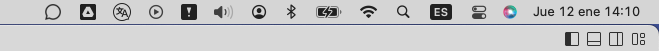
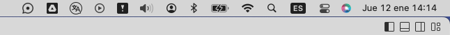
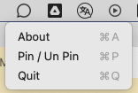
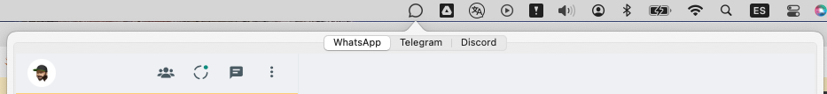

# WtsOnBar - Social Messengers in one place for OSX MAC

It's a simply web clients on your header task bar, separated by tabs.

***How it's works?*** Open tab scan QR code for link your account and go

For now supported three tabs:
 * Whats app
 * Telegram
 * Discord

Tab view: 
Tab view with notify of any new message: 
Right click over icon: 
Left click over icon: 

If you reuse this code or it's a place to inspiration, please tag my repo.

## Compile

Open `./WtsOnBar.xcodeproj` in XCode, set your license and compile it.

## Contributing
All ideas or contributes are welcome.

### TODO | Knowledge of bugs
    [] Open / download documents
    [] Open links form messenger to external browser
    [] Posibility to add tabs
        [] Configuration of tabs / add custom web clients
    [] Optimization of usage
    [] WebKit Separete localStorage from different views
    [x] Drag n' Drop
    [x] Copy / Paste (text, images, files)